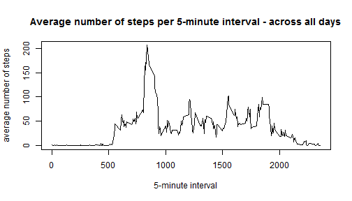
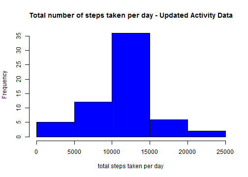
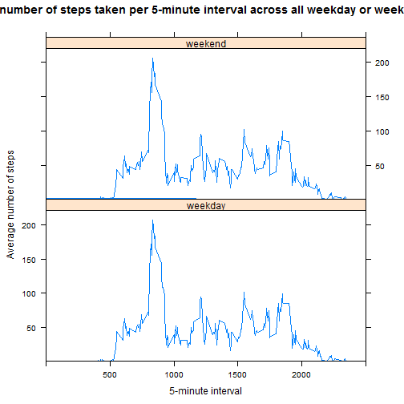

## Introduction
We were asked to conduct an exploratory data analysis of data collected from the use of a personal activity monitoring device. The device collected data at 5 minute intervals through out the day. The dataset provided consisted of two months of data from an anonymous individual collected during the months of October and November, 2012 and included the number of steps taken in 5 minute intervals each day.

## Data
The data analysis was conducted using a pre-processed dataset downloaded from the course website. The dataset consisted of a comma-separated-value (CSV) file with 17,568 observations and 3 variables (two identification and one explanatory variable).

- steps _(explanatory variable)_ : Number of steps taking in a 5-minute interval (missing values are coded as NA)   
- date _(identity variable)_ : The date on which the measurement was taken in YYYY-MM-DD format    
- interval _(identity variable)_ : Identifier for the 5-minute interval in which measurement was taken  

## Analysis and Discussion
An exploratory data analysis was done using the R programming language. Data manipulation was done with the assitance of the 'dplyr' packagea. The plots were generating using the base graph and lattice graphing package.

### Q1. Loading and pre-processing the data
After loading the required R packages,

```r
library(dplyr)
library(lattice)
```

The first step was the download and unzipping of the dataset into the working directory after an intitial test to see if the required data is not already in the working directory.

```r
if(!file.exists("activity.csv")){
      datasource <- "https://d396qusza40orc.cloudfront.net/repdata%2Fdata%2Factivity.zip"
      if(!file.exists("./data")){dir.create("./data")}
      download.file(datasource, destfile = "./data/Factivity.zip", method = "auto", mode= "wb")     
      unzip("./data/Factivity.zip") 
      rm(datasource) 
}
```
 
The data was then loaded into into memory for the analysis, with the classes for the each of the variables specified as part of the processes to reduce the need for additional process of data before analysis.  

```r
activity <- read.table("activity.csv", header = TRUE, sep = ",",
                       colClasses = c("numeric", "POSIXct", "numeric"), na.strings = "NA" )
```

The attributes of the dataset were assessed,   

```r
str(activity)
```

```
## 'data.frame':	17568 obs. of  3 variables:
##  $ steps   : num  NA NA NA NA NA NA NA NA NA NA ...
##  $ date    : POSIXct, format: "2012-10-01" "2012-10-01" ...
##  $ interval: num  0 5 10 15 20 25 30 35 40 45 ...
```

and the summary statistics generated,

```r
summary(activity)
```

```
##      steps             date                        interval     
##  Min.   :  0.00   Min.   :2012-10-01 00:00:00   Min.   :   0.0  
##  1st Qu.:  0.00   1st Qu.:2012-10-16 00:00:00   1st Qu.: 588.8  
##  Median :  0.00   Median :2012-10-31 00:00:00   Median :1177.5  
##  Mean   : 37.38   Mean   :2012-10-31 00:25:34   Mean   :1177.5  
##  3rd Qu.: 12.00   3rd Qu.:2012-11-15 00:00:00   3rd Qu.:1766.2  
##  Max.   :806.00   Max.   :2012-11-30 00:00:00   Max.   :2355.0  
##  NA's   :2304
```
to determine whether or not further processing required. Based on this output, it was determined that no additional processing was required at this point prior to beginning the exploratory data analysis.

### Q2. What is mean total number of steps taken per day?
To respond to this question, we were asked to generate a histogram of the total number of steps taken each day, and secondly, to calulate and report on the mean and the median of the total number of steps taken per day. As a first step in this analysis, a new data.frame object was created using the dplyr package that had two variables, the date and the total number of steps taken each day, and the summary statistics run to get a initial overview of the structure of the new dataframe.

```r
stepsperday <- activity %>%
      group_by(date)%>%
      summarize(total_steps = sum(steps))
summary(stepsperday)
```

```
##       date                      total_steps   
##  Min.   :2012-10-01 00:00:00   Min.   :   41  
##  1st Qu.:2012-10-16 00:00:00   1st Qu.: 8841  
##  Median :2012-10-31 00:00:00   Median :10765  
##  Mean   :2012-10-31 00:25:34   Mean   :10766  
##  3rd Qu.:2012-11-15 00:00:00   3rd Qu.:13294  
##  Max.   :2012-11-30 00:00:00   Max.   :21194  
##                                NA's   :8
```

Using this new dataframe, a histogram was generated,

```r
with(stepsperday, hist(total_steps, col = "red",
     main = "Total number of steps taken per day - Original Activity Data", 
     xlab = "total steps taken per day"))
```

-1.png) 

and the mean and median of the total number of steps calculated to confirm their consistency with those generated from the use of the summary() function.

```r
meansteps <- round(with(stepsperday, mean(total_steps, na.rm = TRUE)), 0)
mediansteps <- round(with(stepsperday, median(total_steps, na.rm = TRUE)), 0)
rm(stepsperday)
```

The mean(**1.0766 &times; 10<sup>4</sup>**) and the median (**1.0765 &times; 10<sup>4</sup>**) are essentially the same, which when taken with the distribution seen in the histogram, shows that the total number of steps taken per day appears to be normally distributed (i.e. a symmetric distribution largely centered around the mean). 

### Q3. What is the average daily activity pattern?
To respond to this question, we were asked to create a time series plot of the 5-minute interval (x-axis)
and the average number of steps taken, averaged across all days (y-axis), and secondly to determine which 5-minute interval contained the maximum number of steps. As a first step in this analysis, a new data.frame object was created using the dplyr package that had two variables, the 5-minute interval and the average number of steps taken for each interval, averaged across all days, and the summary statistics run to get a initial overview of the structure of the new dataframe.

```r
avedailyact <- activity %>%
      group_by(interval)%>%
      summarize(ave_steps = mean(steps, na.rm=TRUE))
summary(avedailyact)
```

```
##     interval        ave_steps      
##  Min.   :   0.0   Min.   :  0.000  
##  1st Qu.: 588.8   1st Qu.:  2.486  
##  Median :1177.5   Median : 34.113  
##  Mean   :1177.5   Mean   : 37.383  
##  3rd Qu.:1766.2   3rd Qu.: 52.835  
##  Max.   :2355.0   Max.   :206.170
```

Using this dataframe, the time-series plot was generated,

```r
plot(avedailyact, type = "l", xlab="5-minute interval", ylab = "average number of steps",
     main = "Average number of steps per 5-minute interval - across all days")
```

 

and the 5-minute interval containing the maximum average number of steps was computed.

```r
intervalmax <- with(avedailyact, subset(avedailyact, ave_steps == max(ave_steps)))
print(intervalmax)
```

```
## Source: local data frame [1 x 2]
## 
##   interval ave_steps
## 1      835  206.1698
```

The **835** interval had the maximum number of steps on average across all the days in the dataset.

### Q4. Imputing missing values
#### Determining number of rows with missing values
The presence of missing days may introduce bias into some calculations or summaries of the data. As seen from the summary statistics earlier (see Q1), only the 'steps' variable, as the sole explanatory variable, had any missing values. The number of rows with missing values obtained from the summary statistics was confirmed by:

```r
missing <- sum(is.na(activity$steps))
print(missing)
```

```
## [1] 2304
```
**2304** rows were found to have missing values.

#### Strategy for filling in the missing values in the dataset and creation of a new dataset
To replace the missing values in the dataset, I decided to use the average number of steps taken per 5 minute interval across all days (that were computed in the step above), to replace the missing values. to create a new dataset that is equal to the original dataset but with the missing data filled in, the original dataset and the dataset created in Q3 were merged and sorted by date and interval. The summary statistics were computed to assess the new dataset.

```r
newactivity <- merge(activity, avedailyact, by.activity = "interval", by.data3 = "interval")
newactivity <- arrange(newactivity, date, interval)
rm(avedailyact, activity)
str(newactivity)
```

```
## 'data.frame':	17568 obs. of  4 variables:
##  $ interval : num  0 5 10 15 20 25 30 35 40 45 ...
##  $ steps    : num  NA NA NA NA NA NA NA NA NA NA ...
##  $ date     : POSIXct, format: "2012-10-01" "2012-10-01" ...
##  $ ave_steps: num  1.717 0.3396 0.1321 0.1509 0.0755 ...
```

```r
summary(newactivity)
```

```
##     interval          steps             date                    
##  Min.   :   0.0   Min.   :  0.00   Min.   :2012-10-01 00:00:00  
##  1st Qu.: 588.8   1st Qu.:  0.00   1st Qu.:2012-10-16 00:00:00  
##  Median :1177.5   Median :  0.00   Median :2012-10-31 00:00:00  
##  Mean   :1177.5   Mean   : 37.38   Mean   :2012-10-31 00:25:34  
##  3rd Qu.:1766.2   3rd Qu.: 12.00   3rd Qu.:2012-11-15 00:00:00  
##  Max.   :2355.0   Max.   :806.00   Max.   :2012-11-30 00:00:00  
##                   NA's   :2304                                  
##    ave_steps      
##  Min.   :  0.000  
##  1st Qu.:  2.486  
##  Median : 34.113  
##  Mean   : 37.383  
##  3rd Qu.: 52.835  
##  Max.   :206.170  
## 
```

The missing values in the new dataset were then replaced as described in the strategy outlined above, the.

```r
for(i in 1:length(newactivity$steps)){
      if(is.na(newactivity$steps[i])== TRUE){
          newactivity$steps[i] = newactivity$ave_steps[i]
      }}
str(newactivity)
```

```
## 'data.frame':	17568 obs. of  4 variables:
##  $ interval : num  0 5 10 15 20 25 30 35 40 45 ...
##  $ steps    : num  1.717 0.3396 0.1321 0.1509 0.0755 ...
##  $ date     : POSIXct, format: "2012-10-01" "2012-10-01" ...
##  $ ave_steps: num  1.717 0.3396 0.1321 0.1509 0.0755 ...
```

```r
summary(newactivity)
```

```
##     interval          steps             date                    
##  Min.   :   0.0   Min.   :  0.00   Min.   :2012-10-01 00:00:00  
##  1st Qu.: 588.8   1st Qu.:  0.00   1st Qu.:2012-10-16 00:00:00  
##  Median :1177.5   Median :  0.00   Median :2012-10-31 00:00:00  
##  Mean   :1177.5   Mean   : 37.38   Mean   :2012-10-31 00:25:34  
##  3rd Qu.:1766.2   3rd Qu.: 27.00   3rd Qu.:2012-11-15 00:00:00  
##  Max.   :2355.0   Max.   :806.00   Max.   :2012-11-30 00:00:00  
##    ave_steps      
##  Min.   :  0.000  
##  1st Qu.:  2.486  
##  Median : 34.113  
##  Mean   : 37.383  
##  3rd Qu.: 52.835  
##  Max.   :206.170
```

A histogram of the total number of days taken each day for this new dataset was created,

```r
totalsteps_day <- newactivity %>%
      group_by(date)%>%
      summarize(total_steps = sum(steps))

with(totalsteps_day, hist(total_steps, col = "blue",
     main = "Total number of steps taken per day - Updated Activity Data", 
     xlab = "total steps taken per day"))
```

 

the mean and median total number of steps taken per day calculated.

```r
meansteps2 <- round(with(totalsteps_day, mean(total_steps, na.rm = TRUE)), 0)
print(meansteps2)
```

```
## [1] 10766
```

```r
mediansteps2 <- round(with(totalsteps_day, median(total_steps, na.rm = TRUE)), 0)
print(mediansteps2)
```

```
## [1] 10766
```

```r
rm(totalsteps_day)
```

There is no difference between the mean(**1.0766 &times; 10<sup>4</sup>**) and the median (**1.0765 &times; 10<sup>4</sup>**) total number of steps taken each day in the original dataset, and The mean(**1.0766 &times; 10<sup>4</sup>**) and the median (**1.0766 &times; 10<sup>4</sup>**) taken each day in this updated dataset, therefore we can conclude that imputing missing values using the strategy we outlined has no impact on the calculation of the mean and median values.

### Q5. Are there differences in activity patterns between weekdays and weekends?
To respond to this question, we were asked use the updated dataset (from Q4) to create a new factor variable in the dataset with two levels - "weekday" and "weekend" indicating whether a given date is a weekday or weekend day and Make a panel plot containing a time series plot of the 5-minute interval (x-axis) and the average number of steps taken, averaged across all weekday days or weekend days (y-axis).

The dplyr package was used to create the new variable and to incorporate it into the updated dataset,

```r
finalactivity <- newactivity%>%
      mutate(day = weekdays(date))

for(i in 1:length(finalactivity$day)){
      if(finalactivity$day[i] == "Sunday" | finalactivity$day[i] == "Saturday"){
            finalactivity$day2[i] <- "weekend"
      }else{
            finalactivity$day2[i] <- "weekday"}
}

finalactivity$day2 <- as.factor(finalactivity$day2)

str(finalactivity)
```

```
## 'data.frame':	17568 obs. of  6 variables:
##  $ interval : num  0 5 10 15 20 25 30 35 40 45 ...
##  $ steps    : num  1.717 0.3396 0.1321 0.1509 0.0755 ...
##  $ date     : POSIXct, format: "2012-10-01" "2012-10-01" ...
##  $ ave_steps: num  1.717 0.3396 0.1321 0.1509 0.0755 ...
##  $ day      : chr  "Monday" "Monday" "Monday" "Monday" ...
##  $ day2     : Factor w/ 2 levels "weekday","weekend": 1 1 1 1 1 1 1 1 1 1 ...
```

```r
summary(finalactivity)
```

```
##     interval          steps             date                    
##  Min.   :   0.0   Min.   :  0.00   Min.   :2012-10-01 00:00:00  
##  1st Qu.: 588.8   1st Qu.:  0.00   1st Qu.:2012-10-16 00:00:00  
##  Median :1177.5   Median :  0.00   Median :2012-10-31 00:00:00  
##  Mean   :1177.5   Mean   : 37.38   Mean   :2012-10-31 00:25:34  
##  3rd Qu.:1766.2   3rd Qu.: 27.00   3rd Qu.:2012-11-15 00:00:00  
##  Max.   :2355.0   Max.   :806.00   Max.   :2012-11-30 00:00:00  
##    ave_steps           day                 day2      
##  Min.   :  0.000   Length:17568       weekday:12960  
##  1st Qu.:  2.486   Class :character   weekend: 4608  
##  Median : 34.113   Mode  :character                  
##  Mean   : 37.383                                     
##  3rd Qu.: 52.835                                     
##  Max.   :206.170
```

```r
rm(newactivity, i)
```

and finally, the lattice package used to create the panel plot containing a time series plot and the average number of steps taken, averaged across all weekday days or weekend days was generated.

```r
xyplot(ave_steps~interval|day2, data = finalactivity, layout = c(1, 2),
       ylim = 1:220, xlim = 0:2500, type = "l",
       main = "Average number of steps taken per 5-minute interval across all weekday or weekend days",
       xlab = "5-minute interval", ylab = "Average number of steps")
```

 

Based on this panel plot, there do not appear to be any differences between weekday and weekend activities


